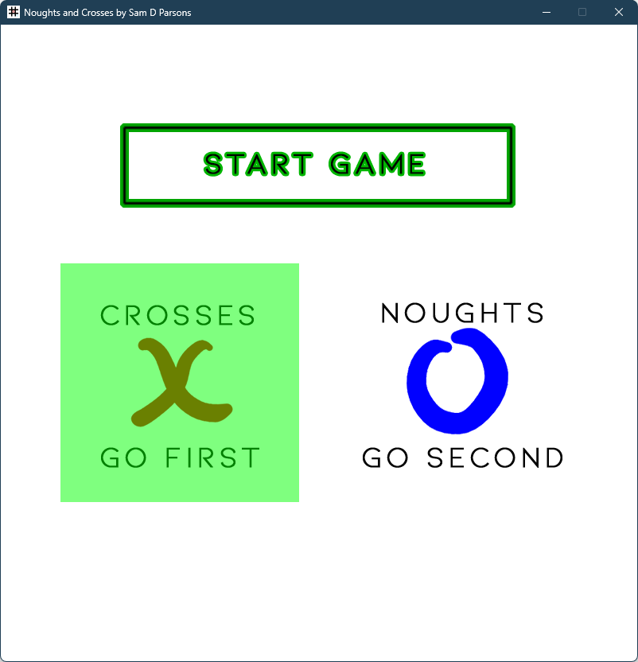
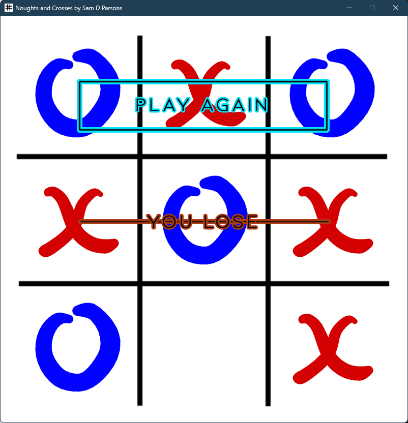
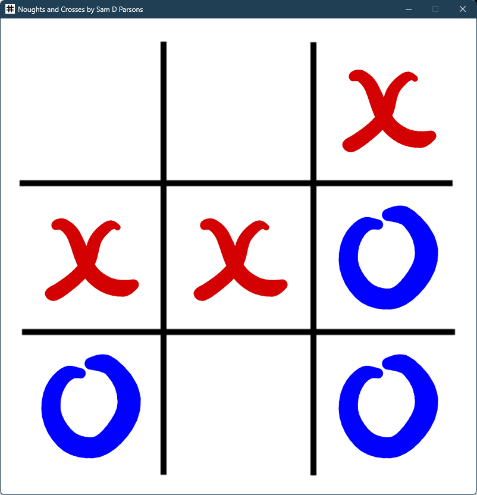

Noughts and Crosses v3.0

by Sam D Parsons

04/06/2023
_______________________
Intro
_______________________

The old game of noughts and crosses (British English), or Tic-tac-toe (American English), programmed in Python using Pygame library. A 3x3 matrix represents the board. Each player is assigned a value of positive one and negative one respectively for drawing the board.

A starting board would look like this:

[ 0  0  0 ] 
[ 0  0  0 ] 
[ 0  0  0 ] 

A diagonal win for player (1) would look like this:

[ 1  0 -1 ] 
[ 0  1  0 ] 
[-1  0  1 ] 

The winning condition was solved using 3x3 matrix and by finding the sum of every, row, column, and both diagonals. A win would result in sum of either 3 or -3. Draw condition was defined as number of moves = 9 and no win condition (i.e. no row, column, diagnoal sum to -3).

_______________________
AI Logic
_______________________

The logic function takes the board and normalises it to function with the inbuilt logic.

The board for logic represents SELF (computer/AI) as 1 and PLAYER as -7. This way preferable moves can be calculated simply using sums of rows, columns, and diagonals. 1 and -7 were used because as sums of three they make very simple and obvious arithmetic outcomes. 1 and -1 for example aren't helpful as row [1, -1 , 0] would sum to 0 which is the same as an empty row.

Then, for example, if I want the AI to look for any possible winning moves, it can be done simply by summing all rows, columns, and digonals. If any of these sum to exactly 2, then there is a winning move. I wrote a second function to get the zero within a given row, column, or diagonal, as the precise winning location is still ambiguous with the knowledge of a row value == 2.

The AI move logic as I have designed it is as follows:

1) Do I move first? (i.e. does board sum to zero.)
Then, always move in the center.

2) Do I move second? (i.e. total board sums to -7.)
a) Is the center free? Then, move in the center.
b) Center is taken. Then, move bottom right corner.

3) Can I win? (i.e. does any row, column, or diagonal sum to 2). Then, win.

4) Will I lose? (i.e. does any row, column, or diagonal sum to -14). Then, prevent win.

5) If none of the above, move in the first available corner.

6) If none of the above, move anywhere free. 

